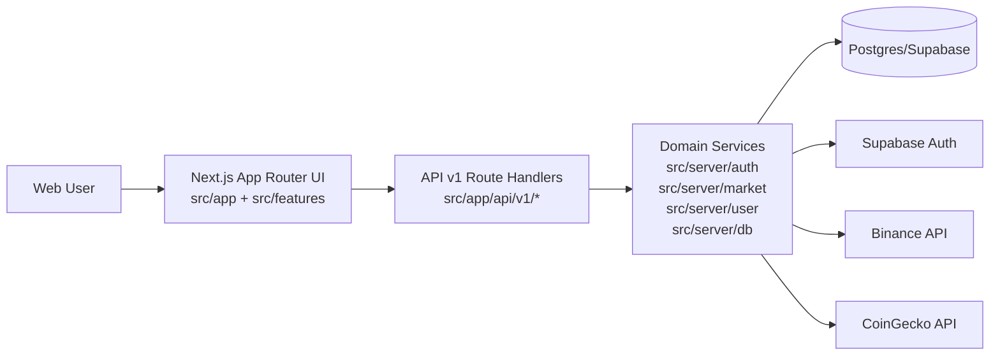

# RYEX System Map (MVP v1)

## 1) Document Control
- Version: `v1.1`
- Owner: `BA`
- Last updated: `2026-04-02`
- Status: `Active`
- Source-of-truth note: Tài liệu này là entry-point kiến trúc chính thức cho MVP. Mọi bản thay thế phải cập nhật version và archive bản cũ để tránh mâu thuẫn.

## 2) Business Context
- MVP objective: Xây dựng web-first crypto exchange nền tảng, ưu tiên luồng người dùng cốt lõi (Auth, Market realtime, Profile, Assets).
- User value:
  - Đăng ký/đăng nhập và xác thực nhanh để vào khu vực giao dịch.
  - Theo dõi thị trường theo thời gian thực với fallback khi upstream lỗi.
  - Quản lý thông tin hồ sơ cơ bản qua API bảo vệ bởi token.
  - Xem tổng tài sản và danh sách coin theo tài khoản funding/trading.
- Architecture support KPI:
  - `Time-to-onboard role mới`: FE/BE/QA nắm boundary trong <= 1 ngày.
  - `Change-fail risk`: giảm lỗi do lệch contract giữa UI và API.
  - `Handoff clarity`: mỗi yêu cầu map được đến impact FE/BE/QA.

## 3) System Boundaries
### In-scope (MVP)
- Next.js App Router cho public và webapp routes.
- API Route Handlers tại `src/app/api/v1/*`.
- Domain services tại `src/server/*` cho auth/market/user/data access.
- Market data proxy từ Binance + CoinGecko.
- Auth theo Supabase Auth, kết hợp lưu dấu vết trên Postgres/Supabase.
- User profile API: đọc/cập nhật profile cơ bản.
- Assets API: lấy số dư tài sản user + enrich giá thị trường.

### Out-of-scope (MVP)
- Spot/Futures execution engine thực tế.
- Ví on-chain, nạp/rút tài sản thật.
- OMS/risk engine chuyên sâu cho production exchange.
- Backoffice compliance workflow đầy đủ.

## 4) Architecture Overview (Layered)

- UI layer: route groups `(marketing)` và `(webapp)` + feature modules (`auth`, `market`, `landing-page`).
- API layer: controller mỏng, điều phối request/response và status code.
- Service layer: business logic, validation, auth/session handling, upstream fetch.
- Data/External layer: Postgres/Supabase cho persistence; Supabase Auth/Binance/CoinGecko cho năng lực ngoài hệ thống.

## 5) Core Runtime Flows
### 5.1 Auth Flow (signup -> verify -> session sync -> market redirect)
1. User gửi `POST /api/v1/auth/signup` (email/password/displayName).
2. API validate input + password policy + rate limit, tạo user qua Supabase Auth.
3. Hệ thống upsert user/auth identity + ghi verification/audit event vào Postgres.
4. User mở callback `GET /api/v1/auth/verify-email/callback` với `token_hash` và `type`.
5. Hệ thống xác minh email, cập nhật trạng thái verified.
6. Client gọi `POST /api/v1/auth/session/sync` với `accessToken` để sync session cookie.
7. Thành công thì điều hướng vào `/app/market`.

### 5.2 Market Flow (polling -> tickers -> stale fallback)
1. Client tại Market page khởi tạo polling theo refresh interval.
2. Gọi `GET /api/v1/market/tickers`.
3. API gọi service market để lấy dữ liệu từ Binance/CoinGecko (qua backend proxy).
4. Nếu upstream OK: trả payload mới (`data`, `fetchedAt`, `stale=false`).
5. Nếu upstream degrade và còn cache: trả dữ liệu cũ với `stale=true`.
6. Nếu upstream lỗi và không có cache: trả error (nhánh service unavailable).
7. UI hiển thị trạng thái loading/error/stale nhưng giữ trải nghiệm ổn định.

### 5.3 Profile Flow (bearer token verify -> profile GET/PATCH)
1. Client gửi bearer token trong `Authorization`.
2. API verify Supabase access token để lấy `supaUid`.
3. `GET /api/v1/user/profile`: đọc user + trạng thái email verified từ Supabase.
4. API trả normalized `user` object cho UI.
5. `PATCH /api/v1/user/profile`: nhận payload update (ví dụ `displayName`).
6. API update bản ghi user theo `supaUid`.
7. Trả profile mới sau cập nhật.

### 5.4 Assets Flow (bearer token verify -> assets aggregate)
1. Client assets page lấy session và gửi bearer token.
2. Gọi `GET /api/v1/user/assets`.
3. API verify token bằng Supabase Auth (`getUser(token)`).
4. Service đọc `user_assets` theo `user_id`.
5. Service enrich giá từ market tickers và aggregate funding/trading.
6. API trả payload tổng tài sản + danh sách assets (hoặc `assets: []` nếu user chưa có tài sản).

## 6) Domain Ownership Map
| Domain | Goal | FE touchpoints | API endpoints | BE services | QA regression scope |
|---|---|---|---|---|---|
| Auth | Đảm bảo onboarding và session hợp lệ | `AuthModulePage`, `StitchLoginPage`, verify callback page | `/api/v1/auth/signup`, `/verify-email/callback`, `/session/sync`, `/login-challenge`, `/resend`, `/logout` | `src/server/auth/*`, `src/server/db/postgres` | Signup validation, verify callback, session sync, logout cookie clear |
| Market | Cung cấp dữ liệu thị trường realtime ổn định | `MarketModulePage`, `PriceChart`, `price` detail page | `/api/v1/market/tickers`, `/price/[symbol]`, `/kline` | `src/server/market/binanceSpotMarket.js` | Ticker contract, stale fallback, polling interval, search + pagination |
| Profile | Cho phép đọc/cập nhật hồ sơ user | Profile consumer flows trong webapp | `/api/v1/user/profile` (GET/PATCH) | Supabase access token verify + Supabase query/update | Unauthorized path, happy path GET/PATCH, response shape consistency |
| Assets | Cho phép xem tổng tài sản và danh sách coin của user | `/app/assets` | `/api/v1/user/assets` (GET) | `src/server/user/assetsRepository.js` + market enrich service | Happy path, unauthorized, empty portfolio, shape stability |
| Data/DB | Bảo toàn dữ liệu theo migration current-truth | N/A (gián tiếp qua API) | N/A (supporting layer) | `src/server/db/*`, `db/migrations/*` | Migration integrity, RLS impact, schema drift risk |

## 7) Known Gaps / Architectural Risks
| Risk ID | Type | Description | Current Impact | Suggested Direction |
|---|---|---|---|---|
| R-01 | Technical/Product | FE auth đang tồn tại 2 pattern song song (`AuthModulePage` vs `StitchLoginPage`) | Dễ lệch behavior và tăng chi phí regression | Chốt 1 auth journey chuẩn cho MVP phase tiếp theo |
| R-02 | Technical/QA | API contract chưa đồng nhất tuyệt đối giữa `error` và `error.code` | Khó chuẩn hóa mapping lỗi FE + test automation | Chuẩn hóa error envelope cho toàn bộ API v1 |
| R-03 | Operational | Data SoT từng thời điểm có mismatch migration history | Dễ gây nhầm khi handoff và apply DB | Duy trì migration-first + cập nhật SoT ngay sau mỗi DB change |
| R-04 | QA | Nhánh lỗi `500 ASSET_FETCH_FAILED` chưa có fault-injection chuẩn | Coverage regression chưa full cho error path | Bổ sung QA sandbox hoặc test hook cho lỗi DB có kiểm soát |

## 8) Traceability Backbone
Chuỗi truy vết bắt buộc cho mọi thay đổi:

`Business goal -> User story -> Acceptance Criteria (Given/When/Then) -> API/UI impact -> QA cases`

Nguyên tắc áp dụng:
- Thiếu một mắt xích thì chưa đủ điều kiện handoff.
- Mọi change request mới phải chỉ rõ map vào chuỗi trên trước khi implement.

## 9) Change Control
- Không đổi behavior/contract đã chốt nếu chưa ghi rõ impact FE/BE/QA.
- Sau khi chốt scope, mọi thay đổi phải thêm `Delta`:
  - `Changed`
  - `Reason`
  - `Impact`
- Versioning rule: thay đổi nhỏ `v1.0 -> v1.1`; thay đổi lớn về cấu trúc `v1.x -> v2.0`.
- Archive policy: bản cũ chuyển vào `docs/archive/` và gắn nhãn `superseded-by`.

## 10) Next Docs Links
- `docs/01-architecture-decisions.md`
- `docs/domain/auth-sot.md`
- `docs/domain/market-sot.md`
- `docs/domain/profile-sot.md`
- `docs/domain/data-sot.md`
- `docs/contracts/api-v1.md`
- `docs/features/Assets/003-Assets-api-contract-freeze-v1.0.md`

## 11) Delta
- `v1.1` (2026-04-02):
  - Added Assets flow to core runtime and domain ownership map.
  - Added Assets-related risk and updated system scope text.
  - Synced links to include Assets contract freeze note.
