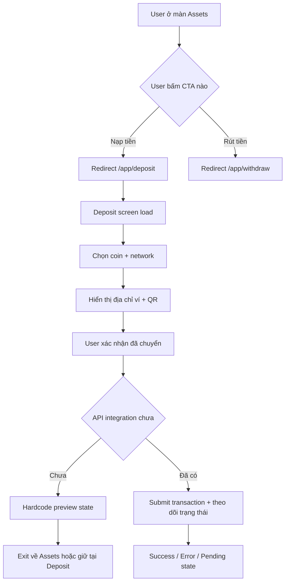

# [Deposit] - UX Flow (v1.0)

## 1. Problem Framing
- Business goal: Chuẩn hóa điểm đến cho luồng nạp tiền để giảm phân mảnh UX giữa các màn hình.
- User impact: User luôn đi qua một màn hình Deposit duy nhất sau khi bấm `Nạp tiền` từ `Assets`.
- KPI gợi ý:
  - Tỷ lệ user vào đúng route `/app/deposit` từ CTA `Nạp tiền` >= 99%.
  - Giảm số phiên drop-off tại bước chọn coin/network >= 20% sau khi tích hợp logic thật.

## 2. Scope
- In-scope (P0):
  - Redirect chuẩn hóa từ các CTA nạp/rút ở Assets bằng helper chung.
  - Màn hình Deposit hardcode để chốt cấu trúc UIUX.
  - Handoff artifacts cho FE/BE/QA.
- Out-of-scope:
  - Tạo địa chỉ ví thật qua API.
  - Polling trạng thái blockchain real-time.
  - Business validation final (min deposit, fee động, risk engine).

## 3. User Flow Diagram

## 4. Entry / Exit States
- Entry:
  - Entry point chính: `Assets hero CTA`, `Assets table row`, `AssetsDropdown quick action`.
  - Route entry: `/app/deposit`.
- Exit:
  - Quay về `/app/assets` (manual nav).
  - Giữ user ở Deposit để theo dõi trạng thái.
  - Trong phase sau: chuyển sang chi tiết giao dịch sau submit thành công.

## 5. Runtime Gap
- Expected behavior:
  - Tất cả CTA nạp tiền dùng chung một cơ chế điều hướng.
- Current behavior (sau update v1.0 này):
  - Dùng helper chung `goToDeposit()` cho CTA nạp có handler.
  - CTA rút ở Assets/Dropdown dùng `goToWithdraw()` để giữ luồng funding tập trung ở Assets.
- Proposed resolution next:
  - Phase API: gắn `source=assets` query hoặc tracking event để đo funnel theo entry point.

## 6. Acceptance Criteria (Given/When/Then)
- AC-01 Redirect Deposit:
  - Given user ở Assets hoặc AssetsDropdown
  - When user bấm CTA `Nạp tiền`
  - Then hệ thống điều hướng về `/app/deposit` qua helper chung.
- AC-02 Redirect Withdraw:
  - Given user ở Assets hoặc AssetsDropdown
  - When user bấm CTA `Rút tiền`
  - Then hệ thống điều hướng về `/app/withdraw` qua helper chung.
- AC-03 Deposit UX skeleton:
  - Given user vào `/app/deposit`
  - When trang render
  - Then thấy đủ các block: Header, chọn token, địa chỉ nạp, lưu ý mạng, state preview, empty history.

## 7. Impact Map
- FE impact:
  - Thêm helper điều hướng funding chung.
  - Refactor Deposit thành component con để dễ ghép logic.
- BE impact:
  - Chưa thay đổi API.
  - Cần chuẩn bị contract tạo địa chỉ nạp và check trạng thái tx cho phase sau.
- QA impact:
  - Bổ sung test case redirect và smoke test route `/app/deposit`.

## 8. Risks + Decisions
- Risks:
  - Hardcode chưa có dữ liệu thật có thể che khuất edge cases fee/network unavailable.
  - Khi nối API có thể phát sinh thêm state không có trong mock.
- Decisions cần chốt:
  - Ưu tiên coin/network mặc định theo region hoặc theo balance user.
  - Quy tắc retry/polling trạng thái nạp ở phase tích hợp.
