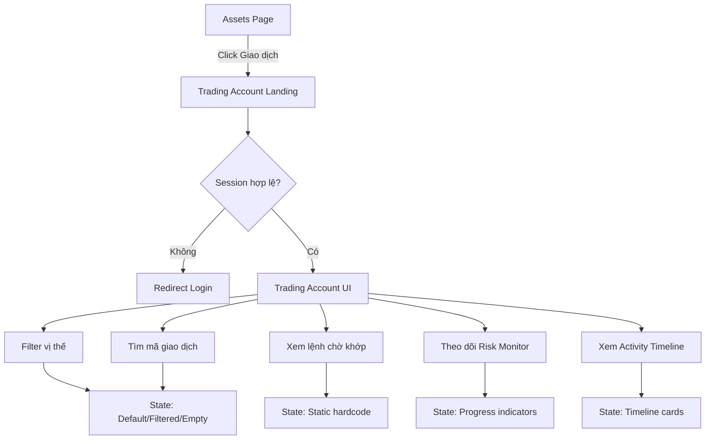

# Trading Account UX Flow v1.0

## Scope
- Entry page: `/app/trading-account`
- Context: user click button `Giao dịch` từ màn hình Assets (`/app/assets`).
- Phase: UI hardcode only, chưa nối API/real-time engine.

## User Flow Diagram

## Entry / Exit States
- Entry:
  - `/app/assets` table action `Giao dịch`.
  - Trading card action `Chi tiết` hoặc `Giao dịch ngay`.
  - Sidebar/Tabbar item `Giao dịch`.
- Exit:
  - Điều hướng sang login nếu chưa auth.
  - Giữ ở trang Trading Account khi thao tác filter/search.

## Design Intent
- Nhấn mạnh trust + control: balance summary, risk panel, open positions.
- Mobile-first read order: Hero -> KPI -> Positions -> Orders -> Risk -> Activity.
- Desktop: split 8/4 cho vùng data lớn và panel điều hành.
